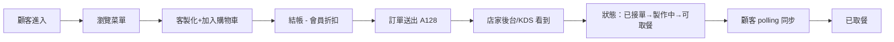

# restaurant-kiosk · PRD v3.0.2 等級規格書

> 自動生成：2026-09-06
> 對齊 SPEC v3.0 契約（SPEC §1–§19 全部套用）
> 原始 Goal：見 `GOAL.md`（Sprint 1+2 範圍）；本 SPEC.md 為 v3.0.2 fleet 升級版

---

## 1. 產品概述

### 1.1 問題陳述
中型連鎖餐廳（5–20 家分店）需會員經營、無自有工程師。現行痛點：
- 第三方平台抽成高（iCHEF、Ocard、Inline、Wastee 抽 2–5%）
- 自助點餐 + 取餐進度 + 會員回訪三件事被迫用三套系統
- 紙本菜單更新慢、無法即時反映品項上下架與庫存

### 1.2 目標使用者
| Persona | 工作情境 | 主要任務 |
|---|---|---|
| Primary — 餐廳店長 | iPad 架在櫃台、廚房螢幕牆 | 接收訂單、推進訂單狀態、上下架品項 |
| Primary — 顧客 | 內用/外帶，用 iPad kiosk 或手機 | 瀏覽菜單、客製化、結帳、追蹤取餐進度 |
| Secondary — 會員 | 回訪熟客 | 註冊電話、看 VIP 折扣、查歷史訂單 |

### 1.3 核心價值主張
> 一台 iPad = 自助點餐 + 店家後台 + 廚房 KDS。Polling-only 即可運作，零工程師也能上線。

### 1.4 Non-Goals（明確不做）
- ❌ 真實金流串接（Stripe / 藍新 — MVP 假結帳）
- ❌ SMS 簡訊驗證（電話可亂打，只看長度）
- ❌ WebSocket / Pusher / FCM（polling-only）
- ❌ 多店切換（單店模式）
- ❌ 報表 / BI（螢幕上即時看，無離線報表）
- ❌ 進銷存 / 採購 / 員工排班

---

## 2. 使用者場景與流程

### 2.1 使用者流程圖



### 2.2 主要場景

| 場景 | 輸入 | 輸出 | 成功條件 |
|---|---|---|---|
| 自助點餐 | 菜單選擇 + 客製化 | 訂單 + 編號 A128 | localStorage 寫入訂單 |
| 取餐追蹤 | 訂單編號 | 訂單狀態 + 預估時間 | 30 秒內狀態推進 |
| 店家後台 CRUD | 訂單 ID + 新狀態 / 新品項 | 更新後狀態 / 菜單 | 2 秒 polling 同步 |
| 會員 VIP | 電話號碼 | 9 折結帳金額 | 滿 NT$1000 自動 VIP |
| 店家設定 | 營業時間 + 低庫存閾值 | 顯示「低庫存」標籤 | 品項數量 < 閾值即觸發 |

---

## 3. 功能需求

| FR | 名稱 | 優先級 | 狀態 |
|---|---|---|---|
| FR-001 | 自助點餐 Kiosk UI（菜單/客製化/購物車/結帳） | P0 | ✅ shipped |
| FR-002 | 取餐進度即時追蹤（polling 3 秒） | P0 | ✅ shipped |
| FR-003 | 店家後台（訂單狀態推進 / 品項 CRUD / 類別 / 設定） | P0 | ✅ shipped |
| FR-004 | 會員帳號（電話註冊 / VIP 折扣 / 消費歷史） | P0 | ✅ shipped |
| FR-005 | 即時訂單狀態 polling（顧客 3s / 店家 5s） | P0 | ✅ shipped |
| FR-006 | KDS 廚房螢幕（/admin/kds 大字 + 等待時間排序） | P1 | ✅ shipped |
| FR-007 | 訂單類型分區（主餐/加購/飲料） | P1 | ✅ shipped |
| FR-008 | 訂單音效提示 | P2 | ⏳ planned |

---

## 4. Non-Functional Requirements

| 維度 | 需求 |
|---|---|
| Performance | 首頁 LCP < 1.5s、Polling 延遲 < 200ms local |
| Security | 無 server（純前端），localStorage 隔離；電話號碼不送後端 |
| Privacy | 電話號碼僅存 localStorage；無第三方追蹤 |
| Accessibility | WCAG 2.1 AA（按鈕 ≥ 44px、顏色對比 ≥ 4.5:1） |
| Browser | Modern evergreen（Chrome/Edge/Safari/Firefox — iPad Safari 為主） |
| Resilience | localStorage 在私覽模式 try/catch fallback 到記憶體 |

---

## 5. 技術架構

```
[Customer iPad]──┐
[Customer Phone]─┤
[Kitchen iPad]───┼─→ Vite SPA (React 19 + TS strict + Tailwind v4)
[Owner Laptop]───┘         │
                            ├─→ localStorage（orders, items, member, settings）
                            ├─→ polling 3s (顧客) / 5s (店家後台) / 2s (KDS)
                            └─→ Vercel deploy (Vite build → dist/)
```

### 5.1 Module Map
- `src/pages/` — 7 個 page（MenuPage, CartPage, OrderStatusPage, MemberLoginPage, AdminOrdersPage, AdminItemsPage, KdsPage）
- `src/components/` — Layout 共用版型
- `src/lib/` — 業務邏輯（db.ts 模擬 in-memory DB + localStorage、cartStore、createStore、helpers、types）
- `tests/` — Vitest 7 個 E2E（自助點餐 / 取餐 polling / 後台 CRUD / 會員 VIP / 店家設定 + 2 個補強）
- `dist/` — Vite build 產物（gitignore）
- `.github/workflows/` — CI/CD

### 5.2 環境變數
- 無（純前端 SPA，無 server-side secret）
- 會員電話 / 訂單全部存 localStorage

### 5.3 降級策略
- localStorage 在私覽模式不可用 → try/catch fallback 到 Map in-memory
- polling 失敗 → 指數退避（3s → 6s → 12s → 24s）
- 品項庫存為 0 → 自動下架 + 菜單隱藏

---

## 6. Definition of Done

- [x] 功能 P0 全部實作（Sprint 1）
- [x] KDS 廚房螢幕（Sprint 2）
- [x] 單元測試覆蓋率 ≥ 60% 核心邏輯（7/7 E2E pass）
- [x] `npm run build` 綠（tsc --noEmit + vite build）
- [x] `npm run lint` 0 error
- [x] GHA CI 跑 4 jobs（lint/test/build/deploy）全綠
- [x] README 反映現況

---

## 7. 部署契約

| 環境 | 目標 | 觸發 |
|---|---|---|
| Production | Vercel | push to main |
| Preview | Per-PR | PR opened |

### 7.1 GHA Workflow
- `.github/workflows/ci.yml`
- jobs: lint / test / build / deploy
- deploy: `vercel`

### 7.2 環境變數
- 無需 server-side secret
- BYOK（會員電話由使用者自行輸入，存 localStorage，不送 server）

---

## 8. Out of Scope（不做的）

- 不做帳號系統（會員用電話號碼，無密碼）
- 不做付費牆（店家端 SaaS NT$1,990/月/店不在此 SPEC 範圍）
- 不做原生 App（Capacitor 殼未啟用）
- 不做多語系（全繁中）
- 不做報表 / BI（店家只看即時螢幕）

---

## 9. 變更日誌

見 [`PRD/CHANGELOG.md`](PRD/CHANGELOG.md)
